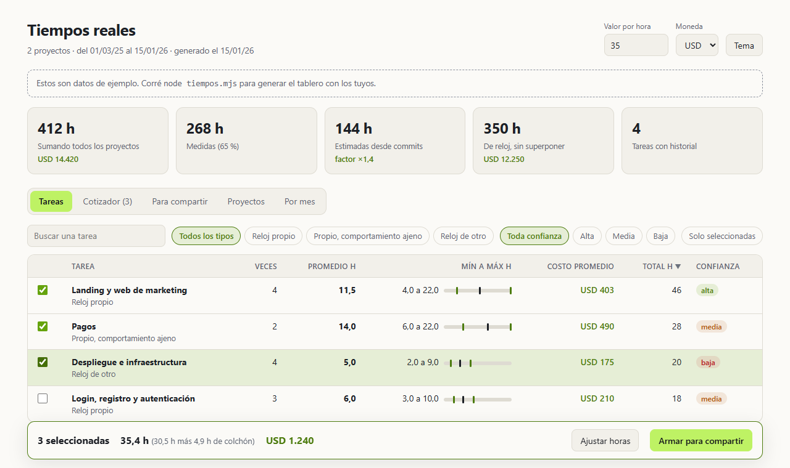

# tiempos-reales

Cuánto tiempo llevó de verdad cada tarea en cada proyecto, para cotizar con datos y no
con intuición. Si "pagos con MercadoPago" ya se hizo en tres proyectos, el número para
el cuarto sale del promedio de esos tres.



- `catalogo.md` · promedio, mínimo y máximo por tarea genérica, sumando todos los proyectos.
- `proyectos/<proyecto>.md` · el detalle de cada proyecto por funcionalidad, persona y mes.
- `manual.csv` · horas cargadas a mano (ver abajo).
- `config.json` · quién sos, con quién trabajás y qué carpetas son qué proyecto (ver abajo).
- `tablero.html` · los mismos números en una página que se abre con doble clic: tabla de tareas con filtros, valor por hora para ver el costo, cotizador con colchón por tipo de trabajo, una hoja para compartir la estimación sin datos internos, proyectos y horas por mes. Se regenera con el script a partir de `tablero.plantilla.html`, que abierta sola muestra datos de ejemplo.
- `tiempos.mjs` · el script que genera todo lo anterior.

Los informes no llevan contenido de los chats: solo nombres de temas y números. Todo
queda en tu máquina. `config.json`, `manual.csv`, los informes y `tablero.html` están
en el `.gitignore`, así que tus proyectos y tus horas no se suben aunque versiones la
carpeta.

## Arrancar

```
node tiempos.mjs
```

Sin configurar nada ya funciona: lee tus transcripciones de Claude Code y el git de cada
repo, toma tu identidad del `git config`, y trata cada carpeta de la carpeta de repos como
un proyecto con su nombre. Después abrí `tablero.html`.

Para que los proyectos tengan nombre propio, juntar varias carpetas en uno o sumar a tu
equipo, copiá `config.ejemplo.json` a `config.json` y editalo. Si usás Claude Code, el
skill de `skill/SKILL.md` te lo pregunta y lo arma por vos: copiá la carpeta `skill` a
`~/.claude/skills/tiempos-reales` y pedile "configurá tiempos reales".

| Clave | Qué define |
|---|---|
| `yo` | Tu nombre, como va a figurar en los informes |
| `personas` | Vos y tu equipo: nombre y un patrón que reconozca su autor o mail de git |
| `proyectos` | Id, nombre, carpetas que lo componen, palabras que lo nombran y temas propios |
| `ignorarCarpetas` | Carpetas que no son proyectos |
| `raicesExtra` | Otras carpetas con proyectos, además de la de repos |

## Regenerar

```
node tiempos.mjs
```

Opciones:

| Flag | Por defecto | Qué hace |
|---|---|---|
| `--transcripciones DIR` | `~/.claude/projects` | Carpeta de transcripciones de Claude Code |
| `--repos DIR` | `~/Documents/GitHub` | Carpeta con los repos (se lee `git log --all` de cada uno) |
| `--corte MIN` | `45` | Hueco que corta una sesión |
| `--arranque MIN` | `15` | Minutos de arranque que suma cada sesión |
| `--desde-transcripciones AAAA-MM-DD` | la primera que encuentre | Desde cuándo hay transcripciones confiables |
| `--manual ARCHIVO` | `manual.csv` | Horas cargadas a mano |
| `--salida DIR` | esta carpeta | Dónde escribir los informes |
| `--config ARCHIVO` | `config.json` | La configuración propia |

Sin dependencias: node 18+ y git. Tarda unos minutos porque recorre todas las
transcripciones. Conviene correrlo una vez por semana y commitear el resultado, porque
Claude Code borra las transcripciones viejas y lo que no quedó en un informe se pierde.

## Cómo anotar tiempos de acá en adelante

Lo que se hace con Claude Code ya queda medido solo. Para el resto (compañeros que no lo
usan, trabajo en otras herramientas, reuniones con el cliente, pruebas con el teléfono en
la mano) se agrega una fila en `manual.csv` (copiá `manual.ejemplo.csv`):

```
fecha,proyecto,tarea,horas,quien,nota
2026-10-06,mi-app,pagos-mp,3.5,Sofía,webhook de reintentos
```

- `proyecto`: el id del proyecto en `config.json`, o el nombre de su carpeta. Si es
  nuevo, se crea solo.
- `tarea`: un id del catálogo de abajo, o el nombre exacto de una funcionalidad del
  proyecto definida en `config.json`.

Opcional: en un mensaje de commit, `[t:pagos-mp]` fuerza la tarea de ese commit cuando la
clasificación automática se equivoca.

## Cómo usarlo para cotizar

1. Partir el pliego en tareas del catálogo, sub-ítem por sub-ítem.
2. Para cada una, tomar el **promedio** de `catalogo.md`. Si se hizo una sola vez o la
   confianza es baja, usarlo como referencia y no como número.
3. Mirar el mínimo y el máximo: si el proyecto nuevo se parece al del máximo (más
   integraciones, más terceros), arrancar de ahí.
4. Las horas medidas ya son con Claude Code: **no** aplicarles otra vez el factor de
   aceleración. El factor sirve para cotizar lo que no tiene historial.
5. Colchón por riesgo y no parejo: 13-15 % en "reloj propio", 20-25 % en "reloj de otro"
   (tiendas, dominios, cuentas de terceros), porque ahí además se corre el calendario.
6. Al cerrar el proyecto, regenerar y comparar lo cotizado contra lo real. Eso afina el
   próximo número.

## Cómo se calcula

- **Sesiones**: los eventos de un proyecto (mensajes de Claude Code y commits) se ordenan
  en el tiempo; un hueco mayor al corte arranca otra sesión. Cada sesión vale su duración
  más el arranque.
- **Medido**: sesiones con transcripción (o filas de `manual.csv`).
- **Estimado**: sesiones con commits solos (antes de que existan transcripciones, o de
  quien no usa Claude Code). Valen su duración por un factor que se calibra en el período
  donde hay las dos cosas: horas medidas dividido horas que darían los commits solos. Por
  proyecto si alcanza el dato; si no, el factor conjunto.
- **Funcionalidad**: el primer mensaje del usuario que nombra un tema define el tema de la
  conversación hasta que otro mensaje lo cambie; un worktree dedicado a una rama da el tema
  por defecto; los commits se clasifican por asunto y archivos tocados. Lo que queda sin
  tema dentro de una sesión se reparte según los commits de esa sesión.
- **Proyecto**: por el `cwd` de cada mensaje. Las sesiones que arrancan en la carpeta raíz
  se asignan al proyecto que nombre el usuario; si no nombra ninguno, quedan afuera.
- **Personas**: quien corre el script suma sus sesiones de Claude Code y sus commits,
  incluidos los de los agentes que dispara (Claude, Lovable, Codex). El resto del equipo
  suma sus commits. Los autores que no están en `config.json` se ignoran.
- Proyectos, temas propios y palabras clave están en `config.json`; un repo nuevo en la
  carpeta de repos entra solo con el nombre de su carpeta.

## Catálogo de tareas

| id | Tarea | Quién maneja el reloj |
|---|---|---|
| `auth` | Login, registro y autenticación | propio |
| `onboarding` | Onboarding y alta de usuarios | propio |
| `pagos-mp` | Pagos con MercadoPago | ajeno |
| `pagos-otros` | Pagos con otras pasarelas (Stripe, Lemon, PayPal) | ajeno |
| `billing-tiendas` | Suscripciones y billing de tiendas | otro |
| `tiendas` | Publicación en tiendas (Play / App Store) | otro |
| `expo` | App nativa (Expo / React Native) | ajeno |
| `push` | Notificaciones push | otro |
| `whatsapp` | WhatsApp | otro |
| `emails` | Emails transaccionales | otro |
| `voz` | Voz con IA (TTS / STT / tiempo real) | ajeno |
| `chat-ia` | Chat con IA | ajeno |
| `contenido-ia` | Generación de contenido con IA | ajeno |
| `pdf` | PDF e imprimibles | propio |
| `gamificacion` | Gamificación (juegos, avatares, logros) | propio |
| `cupos` | Cupos, topes y reglas de plan | propio |
| `panel-usuario` | Panel del usuario y métricas | propio |
| `admin` | Panel de admin, alertas y backoffice | propio |
| `seo` | SEO | propio |
| `landing` | Landing y web de marketing | propio |
| `legales` | Legales y políticas | propio |
| `seguridad` | Seguridad, anti-spam y protección de menores | ajeno |
| `analitica` | Analítica y telemetría | propio |
| `i18n` | Internacionalización y localización | propio |
| `integraciones` | Integraciones con APIs de terceros | ajeno |
| `crecimiento` | Referidos, campañas y crecimiento | propio |
| `video` | Video y material de producto | propio |
| `datos` | Base de datos y migraciones | propio |
| `infra` | Despliegue e infraestructura | otro |
| `rediseno` | Rediseño UI y design system | propio |
| `tests` | Tests y QA | propio |
| `crud` | CRUD, listados y pantallas de producto | propio |
| `docs-negocio` | Documentación, investigación y negocio | propio |
| `mantenimiento` | Mantenimiento, bugs y refactors | propio |

Propio: factor 0,3-0,4 sobre una estimación tradicional. Ajeno (propio, pero con
comportamiento de terceros: webhooks, tiempo real, máquinas de estado de pago): 0,5-0,6.
Otro (alta de cuentas, revisión de tiendas, dominios de correo, esperar al cliente): 0,7-0,9.

## Límites conocidos

- Claude Code borra transcripciones viejas: lo anterior a la primera que quede es estimado
  desde los commits, con menos confianza.
- Una sesión con Claude trabajando solo (subagentes, tareas largas) cuenta como tiempo del
  proyecto aunque nadie esté mirando. Cada proyecto muestra aparte las horas con
  mensajes tuyos.
- La suma por proyecto cuenta dos veces las sesiones en paralelo; el catálogo muestra
  también las horas de reloj sin superponer.
- La clasificación por palabras clave se equivoca en los bordes; la confianza de cada fila
  lo indica.

## Apoyar

[](https://ko-fi.com/surlabs)

Es gratis y todo queda en tu máquina. Si te ahorra tiempo, podés [bancar la próxima herramienta en Ko-fi](https://ko-fi.com/surlabs).

## Licencia

MIT. Ver [LICENSE](LICENSE).
